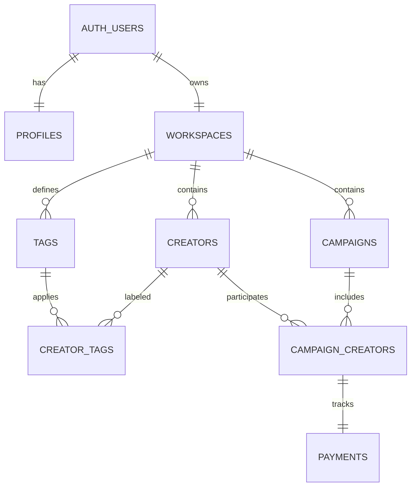

# Database design

## Ownership model

Each authenticated user owns at most one workspace. Every operational record carries `workspace_id`, which keeps queries simple and makes RLS checks explicit. The application never accepts a client-supplied workspace identifier; it resolves ownership from the authenticated session.

## Relationships

## Constraints

- Collaboration stage: `contacted`, `confirmed`, `content_due`, `posted`, `paid`
- Campaign status: `draft`, `active`, `completed`, `archived`
- Stored payment status: `not_due`, `due`, `paid`, or legacy-compatible `overdue`
- Displayed overdue state is derived when an incompletely paid record has a due date before today.
- `(campaign_id, creator_id)` is unique.
- `(workspace_id, tag.name)` is unique.
- Each collaboration has at most one payment.
- End date must be on or after campaign start date.
- Paid amount cannot exceed agreed amount.

## Sample records

`is_sample` is included on operational tables so onboarding and development data can be removed without touching user-created records. The `remove_sample_data()` function resolves the active workspace server-side before deletion.

## Migrations

- `001_create_waitlist_signups.sql`: isolated landing-page waitlist
- `002_fluebaze_mvp.sql`: complete authenticated MVP
- `seed.sql`: optional development-only sample dataset

Apply migrations in numeric order.
